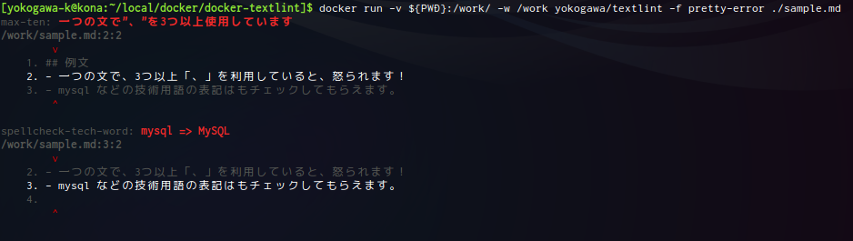
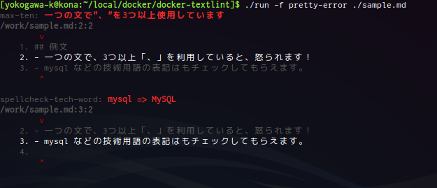

Docker Image for [azu/textlint](https://github.com/azu/textlint)
====

How to use.
----

notice: enable japanese check plugins with .textlintrc by default.

```console
$ docker run -v ${PWD}:/work/ yokogawa/textlint ./foo.md
```



If you use `./run` script.

```console
$ ./run ./foo.md
```



### use bash

```console
$ ./run bash
```


reference
----

- [azu/textlint](https://github.com/azu/textlint)
- [textlintで日本語の文章をチェックする | Web Scratch](http://efcl.info/2015/09/10/introduce-textlint/)
- [Markdownで書く電子書籍開発環境](http://azu.github.io/slide/niku_sushi/ebook_development.html)
